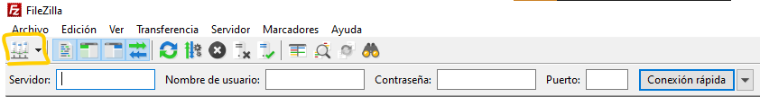
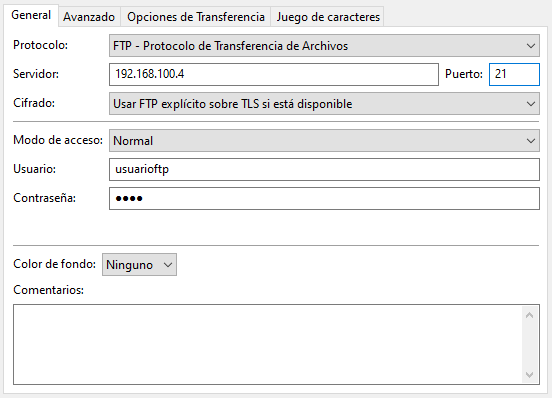
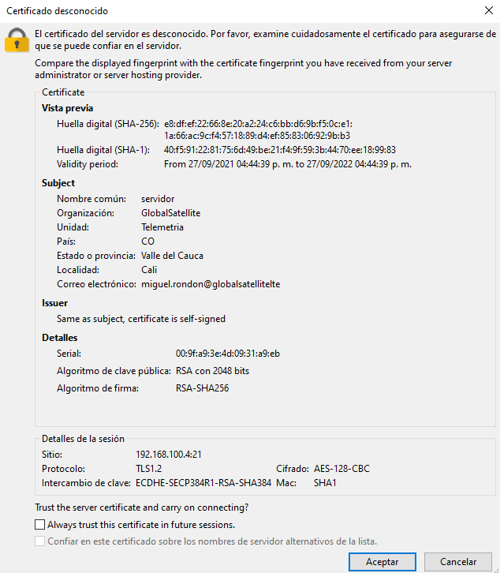

# Red FTP + Firewall + DNS

- [Red FTP + Firewall + DNS](#red-ftp--firewall--dns)
  - [Plan de trabajo](#plan-de-trabajo)
  - [Servicio FTP Seguro](#servicio-ftp-seguro)
    - [Prueba de conexiones con FileZilla](#prueba-de-conexiones-con-filezilla)
  - [Firewall](#firewall)
  - [DNS, maestro - esclavo](#dns-maestro---esclavo)
  - [Cliente](#cliente)
  - [Referencias](#referencias)

## Plan de trabajo

Inicialmente se establecera un servicio FTP no seguro, en el cual se pueda acceder mediante usuarios registrados. Posterior a ello, añadiremos seguridad al servicio FTP y se probara mediante un FILEZILLA.

Una vez establecido nuestro servicio, se abordara la redireccion de consultas mediante el servicios Firewall.

Con la redireccion establecida, se implementara un servidor DNS generico en la misma maquina.

Finalmente, se implementara una sincronización DNS maestro-esclavo

## Servicio FTP Seguro

Una vez creado nuestro servicio FTP, debemos crear un certificado virtual que validara nuestro sitio con la informacion basica de registro (de momento solo validado por nosotros)

```apache
sudo openssl req -x509 -nodes -days 365 -newkey rsa:2048 -keyout /etc/ssl/private/vsftpd.pem -out /etc/ssl/private/vsftpd.pem
```

Datos del certificado ejemplo

```apache
Country Name (2 letter code) [XX]:CO
State or Province Name (full name) []:Valle del Cauca
Locality Name (eg, city) [Default City]:Cali
Organization Name (eg, company) [Default Company Ltd]:GlobalSatellite
Organizational Unit Name (eg, section) []:Telemetria
Common Name (eg, your name or your server's hostname) []:servidor
Email Address []:miguel.rondon@globalsatellitelte
```

Abrimos nuevamente el archivo de configuración

```apache
vim /etc/vsftpd/vsftpd.conf
```

y editamos el archivo de configuracion para apuntar el archivo de configuración al certificado que acabamos de crear

```apache
...

rsa_cert_file=/etc/ssl/private/vsftpd.pem
rsa_private_key_file=/etc/ssl/private/vsftpd.pem
```

Ahora habilitaremos SSL y nos aseguraremos de que solo los clientes que tengan SSL habilitados nos puedan contactar. Cambia el valor de ssl_enable a YES:

```apache
...

ssl_enable=YES
```

---

> [!NOTE]
> No se realizo el siguiente paso

Ahora agrega las siguientes líneas para mayor protección: (Esto no permitirá conexiones anónimas a través de SSL)

```apache
allow_anon_ssl=NO
force_local_data_ssl=YES
force_local_logins_ssl=YES
```

---

Configura el servidor para usar TLS usando:

```apache
ssl_tlsv1=YES
# ssl_sslv2=NO
# ssl_sslv3=NO
```

---

> [!NOTE]
> No se realizo el siguiente paso

Aquí agregaremos 2 opciones más. En primer lugar, no será necesario reutilizar SSL porque puede ocasionar que muchos clientes de FTP se averíen. En segundo lugar, utilizaremos suites de encriptación de alto cifrado, lo que significa que las longitudes de claves son iguales o superiores a 128 bits.

```apache
require_ssl_reuse=NO
ssl_ciphers=HIGH
Comencemos una vez más para aplicar las nuevas configuraciones:

sudo systemctl restart vsftpd
```

¡Buen trabajo! Has configurado el servidor FTP en tu VPS de Ubuntu para que funcione con el protocolo SSL/TLS.

---

### Prueba de conexiones con FileZilla

Hoy en día, la mayoría de los clientes de FTP admiten configuraciones de cifrado TLS, por lo que es una excelente manera de comprobar si tu servidor FTP de Ubuntu funciona según lo previsto. Para probar la conexión, utilizaremos un cliente FTP de FileZilla. Para comenzar inicia FileZilla y haz clic en el icono de Site Manager



Completa todos los detalles requeridos con tu información del servidor FTP de Ubuntu recién creada. Como lo configuramos para usar TLS, también podemos marcar el cifrado para que sea explícitamente FTP sobre TLS. La configuración final debería verse así



Finalmente, tendrás que verificar el certificado SSL de tu servidor FTP en Ubuntu VPS.



Tomado de [^1]

```sequence
Note left of VM3: Cliente
Note left of VM3: 192.168.100.2
Note left of VM2: Servicios
Note left of VM2: 192.168.100.4

VM3 -> VM2: Solicitud de conexion FTP
VM2 -> VM3: Denegar / Aceptar + certificado
VM3 -->> VM2: Solicitud de informacion tipo FTP
VM2 -->> VM3: informacion
VM3 -> VM2: Cerrar session
VM2 -> VM3: Desconectar
```

## Firewall

Debemos permitir el puerto predeterminado del servicio DNS 53 a través del firewall.

```apache
firewall-cmd --permanent --add-port=53/udp
```

Redireccionamos los puertos para el protocolo tcp

```apache
firewall-cmd --permanent --zone=dmz --add-forward-port=port=53:proto=tcp:toport=53:toaddr=192.168.100.4
firewall-cmd --permanent --zone=dmz --add-forward-port=port=53:proto=udp:toport=53:toaddr=192.168.100.4
```

Debemos permitir el puerto predeterminado del servicio FTP

```apache
firewall-cmd --permanent --add-port=20/tcp
firewall-cmd --permanent --add-port=21/tcp
firewall-cmd --permanent --zone=dmz --add-service=ftp
```

Redireccionamos los puertos para el protocolo tcp

```apache
firewall-cmd --zone=internal --add-forward-port=port=20:proto=tcp:toport=20:toaddr=192.168.100.4
firewall-cmd --zone=internal --add-forward-port=port=21:proto=tcp:toport=21:toaddr=192.168.100.4
```

---

Tomado de [^2]

Principalmente habilitamos los puertos de escucha de sftp

```apache
firewall-cmd --zone=dmz --add-port=990/tcp
firewall-cmd --zone=dmz --add-port=9122/tcp
firewall-cmd --permanent --zone=dmz --add-service=tftp
```

Para la conexion vsftp debemos habilitar el puerto de SSL 9122 para no interrumpir la conexion ssh

```apache
firewall-cmd --add-port 9122/tcp --permanent

firewall-cmd --permanent --zone=dmz --add-forward-port=port=9122:proto=tcp:toport=22:toaddr=192.168.100.4
```

Otra forma

```apache
firewall-cmd --zone=dmz --add-forward-port=port=990:proto=tcp:toport=990:toaddr=192.168.100.4
firewall-cmd --zone=dmz --add-forward-port=port=990:proto=udp:toport=990:toaddr=192.168.100.4
```

> [!CAUTION]
> No se recomienda la redirección del puerto 22 para la conexion al sftp debido a que podria interrumpir nuestra conexion a la maquina virtual, como se ve a continuacion
> 
> ```apache
> firewall-cmd --zone=dmz --add-forward-port=port=22:proto=tcp:toport=22:toaddr=192.168.100.4
> firewall-cmd --zone=dmz --add-forward-port=port=22:proto=udp:toport=22:toaddr=192.168.100.4
> 
> firewall-cmd --permanent --zone=dmz --remove-forward-port=port=22:proto=tcp:toport=22:toaddr=192.168.100.4
> firewall-cmd --permanent --zone=dmz --remove-forward-port=port=22:proto=udp:toport=22:toaddr=192.168.100.4
> ```

Finalmente recargamos y comprobamos la conexion

```apache
firewall-cmd --reload

firewall-cmd --zone=dmz --list-all
```

Y obtenemos para dmz, algo asi:

```apache
[root@firewall ~]# firewall-cmd --zone=dmz --list-all
dmz (active)
  target: default
  icmp-block-inversion: no
  interfaces: eth1
  sources:
  services: ftp http https ssh
  ports: 21/tcp 20/tcp 53/tcp 53/udp
  protocols:
  masquerade: yes
  forward-ports: port=443:proto=tcp:toport=443:toaddr=192.168.100.4
        port=20:proto=tcp:toport=20:toaddr=192.168.100.4
        port=20:proto=udp:toport=20:toaddr=192.168.100.4
        port=21:proto=tcp:toport=21:toaddr=192.168.100.4
        port=21:proto=udp:toport=21:toaddr=192.168.100.4
        port=53:proto=tcp:toport=53:toaddr=192.168.100.4
        port=53:proto=udp:toport=53:toaddr=192.168.100.4
        port=9122:proto=udp:toport=22:toaddr=192.168.100.4
        port=9122:proto=tcp:toport=22:toaddr=192.168.100.4
  source-ports:
  icmp-blocks: echo-request echo-reply
  rich rules:
```

Mientras que para internal

```apache
[root@firewall ~]# firewall-cmd --zone=internal --list-all
internal (active)
  target: default
  icmp-block-inversion: no
  interfaces: eth2
  sources:
  services: dhcpv6-client http https mdns samba-client ssh
  ports:
  protocols:
  masquerade: yes
  forward-ports:
  source-ports:
  icmp-blocks:
  rich rules:
```

--

Borrar registro de claves ssh ver [^3]

---

## DNS, maestro - esclavo

Configuramos las el servicio

```apache
vim /etc/named.conf
```

```apache
options {
        listen-on port 53 { 127.0.0.1; 192.168.100.5;};
        ...
        ...
        allow-query     { localhost; 192.168.100.0/24; };

...

zone "globalsatellite.com" IN {
        type master;
        file "globalsatellite.com.fwd";
};

zone "100.168.192.in-addr.arpa" IN {
        type master;
        file "globalsatellite.com.rev";
};

...
```

Hacemos una copia del archivo de configuracion named empy y le damos permisos

```apache
cp /var/named/named.empty /var/named/globalsatellite.com.fwd
cp /var/named/named.empty /var/named/globalsatellite.com.rev

chmod 755 /var/named/globalsatellite.com.fwd
chmod 755 /var/named/globalsatellite.com.rev
```

Configuramos las zonas directa

```apache
vim /var/named/globalsatellite.com.fwd
```

```apache
@ORIGIN globalsatellite.com.
$TTL 3H
@       IN SOA primary.globalsatellite.com root@globalsatellite.com. (
                                                1002    ;Serial
                                                3H      ;Refresh
                                                15M     ;Retry
                                                1W      ;Expire
                                                1D      ;Minimum TTL
                                                )

;Name Server Information
@      IN  NS      primary.globalsatellite.com.

;Secondary Name server
@      IN  NS      secondary.globalsatellite.com.

;Firewall server
@      IN  NS      firewall.globalsatellite.com.

;IP address of Primary Name Server
primary IN  A       192.168.100.5

;IP address of Secondary Name Server
secondary IN A      192.168.100.4

;IP address of firewall Server
firewall IN A      192.168.0.16
```

---

## Cliente

como intalar dig
[CentOS 7 dig command not found – How to install dig on CentOS](https://www.cyberciti.biz/faq/centos-7-dig-command-not-found-how-to-install-dig-on-centos/)

## Referencias

[^1]: [Cómo configurar el servidor FTP en Ubuntu VPS](https://www.hostinger.es/tutoriales/como-configurar-servidor-ftp-en-ubuntu-vps/)
[^2]: [Setting Up DNS Server On CentOS 7](https://www.unixmen.com/setting-dns-server-centos-7/)
[^3]: [I Can’t Connect via SSH or SFTP – Delete SSH known_hosts](https://kinsta.com/knowledgebase/cant-connect-delete-ssh-known-hosts/)
